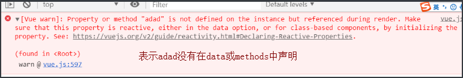
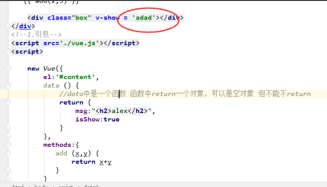
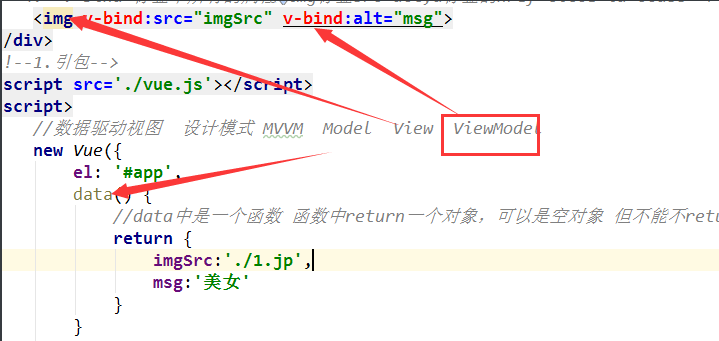
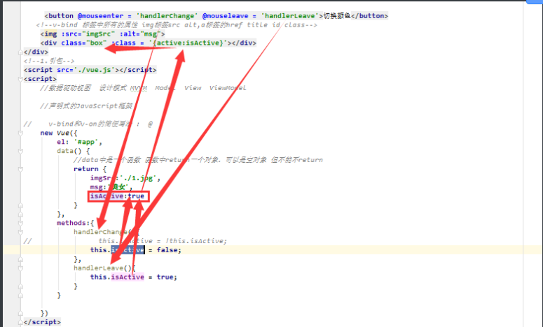
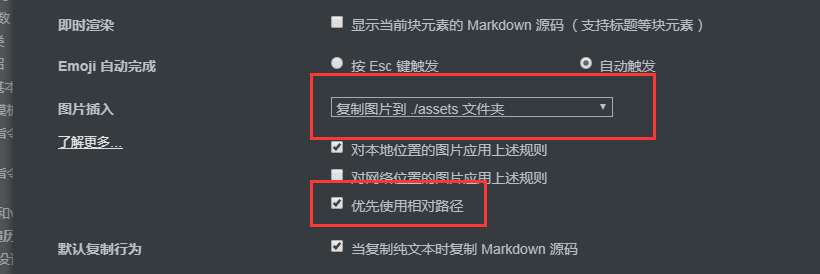

### 今日内容

#### es6的语法

##### let

```js
特点：
1.局部作用域
2.不会存在变量提升
3.变量不能重复声明
```


##### const

```js
特点：	
1.局部作用域 
2.不会存在变量提升 
3.不能重复声明，只声明常量 不可变的量
```


##### 模板字符串

```js
tab键上面的反引号 ${变量名}来插值
let name = '未来';
let str = `我是${name}`
```

|      |      |
| ---- | ---- |
|      |      |
|      |      |
|      |      |


##### 箭头函数

function(){} ===  ()=>{} this的指向发生了改变

##### es6的类

原型 prototype  当前类的父类（继承性）
​		

```javascript
	class Person{
		constructor(name){
			this.name = name;
		}
		fav(){
		}			
	}
	Vue的基本用法
```

#### vue的介绍

前端有三大框架：   可以去github查看三个框架的 star星

| 框架    | 介绍                                                         |
| ------- | ------------------------------------------------------------ |
| vue     | 尤雨溪,渐进式的JavaScript框架                                |
| react   | Facebook公司，里面的高阶函数非常多，对初学者不用好           |
| angular | 谷歌公司，目前更新到6.0，学习angular得需要玩一下typescript		
 Vue     angular2.0 3.0~6.0   React(高阶函数 es6)初学者不友好 |

##### vue的基本引入和创建 

  - 1.下载

    cdn方式下载

    ```html
    <script src="https://cdn.jsdelivr.net/npm/vue@2.5.17/dist/vue.js"></script>
    ```

 - 2.引包

  ```html
  <script src='./vue.js'></script>
  ```

- 3.实例化

  ```js
  //2.实例化对象
  new Vue({
      el:'#app', //绑定那块地
      data:{
          //数据属性  种子
          msg:'黄瓜',
          person:{
              name:'wusir'
          },
          msg2:'hello Vue'
      }
  });
  ```

##### Vue的模板语法

可以插入任何你想插入的内容，除了if-else if-else用三元运算符代替

```html
<!--模板语法-->
<h2>{{ msg }}</h2>
<h3>{{ 'hhahda' }}</h3>
<h3>{{ 1+1 }}</h3>
<h4>{{ {'name':'alex'} }}</h4>
<h5>{{ person.name }}</h5>
<h2>{{ 1>2? '真的': '假的' }}</h2>
<p>{{ msg2.split('').reverse().join('') }}</p>
```

##### Vue的指令系统之v-text和v-html**

```js
v-text相当于innerText
v-html相当于innerHTML
```

##### Vue的指令系统之v-if和v-show

```js
v-show 相当于 style.display
```

v-if和v-show的区别

记住：

```js
v-if vs v-show
v-if 是“真正”的条件渲染，因为它会确保在切换过程中条件块内的事件监听器和子组件适当地被销毁和重建。

v-if 也是惰性的：如果在初始渲染时条件为假，则什么也不做——直到条件第一次变为真时，才会开始渲染条件块。

相比之下，v-show 就简单得多——不管初始条件是什么，元素总是会被渲染，并且只是简单地基于 CSS 进行切换。

一般来说，v-if 有更高的切换开销，而 v-show 有更高的初始渲染开销。因此，如果需要非常频繁地切换，则使用 v-show 较好；如果在运行时条件很少改变，则使用 v-if 较好。
```

##### v-bind 和v-on

```js
v-bind可以绑定标签中任何属性  
v-on 可以监听 js中所有事件

简写：
v-bind:src  等价于   :src
v-on:click 等价于 @click
```

```html
<!DOCTYPE html>
<html lang="zh-CN">
<head>
    <meta charset="UTF-8">
    <title>Title</title>
    <meta name="viewport" content="width=device-width, initial-scale=1">
    <style>
        .box {
            width: 200px;
            height: 200px;
            background-color: red;
        }
        .active{
            background-color: green;
        }

    </style>
</head>
<body>

<div id="app">
    <!--<button v-on:click = 'handlerChange'>切换颜色</button>-->
   <!--v-bind 标签中所有的属性 img标签src alt,a标签的href title id class-->
    <!---->
    <!--<div class="box" v-bind:class = '{active:isActive}'></div>-->

     <button @mouseenter = 'handlerChange' @mouseleave = 'handlerLeave'>切换颜色</button>
   <!--v-bind 标签中所有的属性 img标签src alt,a标签的href title id class-->
    
    <div class="box" :class = '{active:isActive}'></div>
</div>
<!--1.引包-->
<script src='./vue.js'></script>
<script>
    //数据驱动视图  设计模式 MVVM  Model  View  ViewModel

    //声明式的JavaScript框架

//    v-bind和v-on的简便写法 :  @
    new Vue({
        el: '#app',
        data() {
            //data中是一个函数 函数中return一个对象，可以是空对象 但不能不return
            return {
                imgSrc:'./1.jpg',
                msg:'美女',
                isActive:true
            }
        },
        methods:{
            handlerChange(){
//                this.isActive = !this.isActive;
                this.isActive = false;
            },
            handlerLeave(){
                this.isActive = true;
            }
        }
       
    })
</script>

</body>
</html>
```

##### v-for 遍历列表

```javascript
v-for可以遍历列表，也可以遍历对象
在使用vue的v-for指令的时候，一定要绑定key,避免vue帮咱们计算DOM
```

```html
<!DOCTYPE html>
<html lang="zh-CN">
<head>
    <meta charset="UTF-8">
    <title>Title</title>
    <meta name="viewport" content="width=device-width, initial-scale=1">
    <style>
        .box {
            width: 200px;
            height: 200px;
            background-color: red;
        }

        .active {
            background-color: green;
        }

    </style>
</head>
<body>

<div id="app">
    <ul v-if="data.status === 'ok'">
        <!--v-for的优先级是最高的     diff算法-->
        <li v-for = '(item,index) in data.users' :key="item.id" >
            <h3>{{ item.id }} -- {{ item.name }} -- {{ item.age }}</h3>
        </li>
    </ul>
    <div v-for = '(value,key) in person'>
        {{ key }}-----{{ value }}
    </div>
</div>
<!--1.引包-->
<script src='./vue.js'></script>
<script>

    new Vue({
        el: '#app',
        data() {

            return {
                data: {
                    status: 'ok',
                    users: [
                        {id: 1, name: 'alex', age: 18},
                        {id: 2, name: 'wusir', age: 30},
                        {id: 3, name: 'yuan', age: 48}
                    ]
                },
                person:{
                    name:'alex'
                }
            }
        },
        methods: {}

    })
</script>

</body>
</html>
```







##### MVVM设计模式



##### 数据驱动逻辑流程




##### Typora中markdown图片相对路径设置

​	文件-》偏好设置->


